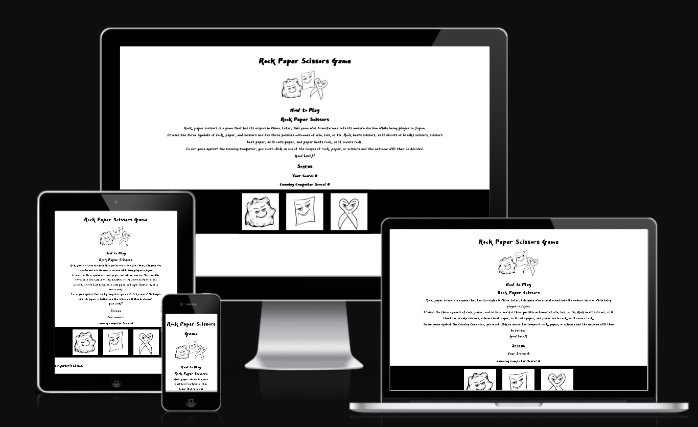
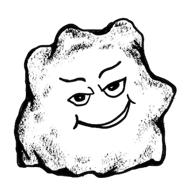
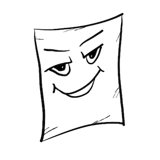

!
# Rock Paper Scissors Game

This is a rock paper scissors game. It is designed to be used by a single player to play against the computer. The user can choose one of three image choices of rock, paper or scissors and try to beat the computer which chooses at random. 

The rules of the game are the same as the original version. Rock beats scissors, scissors beats paper, and paper beats rock.

This game is targeted for people who have an interest in gaming. The additional graphics also incorrporate some more fun into the game. The game lists the rules and instructions at the beginning with a little historical fact on the game origins.

[View the live project here.](https://rachank.github.io/rock-paper-scissors-2/)

## Table of Contents

- [Design Features](###-Design-Features)
- [Technologies Used](###-Technologies-Used)
- [Testing](###-Testing)
- [Deployment](###-Deployment)
- [Credits](###-Credits)

### Design Features

- The Title of the Game is centered and in bold to show . 
- Below the title is a small logo utilizing the combination of the rock, paper and scissors game images with some fun expressions.
- The site is in black and white to better suit and emphasize the style of images it contains
- Google Fonts was used to import the font family East Sea Dokdo, which was chosen and used throughout the entire site with Sans Sarif as the backup font. East Sea Dokdo compliments the style of the images in it's course texture and bold design.
- To increase the enjoyment of the game I designed some fun images to use as start images for rock, paper, and scissors with some fun facial expressions.

- Start images of rock, paper, and scissors

#### Features Left to Implement

- Include a game counter with a start again button
- Include an input request for the player's name and display it in the score board to personlize the game more
- Include improved media queries to format the game to look more compact and fit better on each screen size
- Include mulitple random images for the winner and loser in a pop up modal to better display the outcome of each game

- Some of the Loser Image examples to add:

- Some of the Winner Image examples to add:

### Technologies Used

#### Languages Used

- HTML5
- CSS3
- JavaScript

#### Programs Used

- [Adobe Fresco](https://www.adobe.com/products/fresco.html): used to create original rock, paper, and scissors images.
- [Google Fonts](https://fonts.google.com/): used to import font family 'East Sea Dokdo'.
- [Am I Responsive](https://ui.dev/amiresponsive): used to check responsiveness.
- [Gitpod](https://www.gitpod.io/): used to develope the project's code.
- [GitHub](https://github.com/): used to store the project's code 

### Testing

#### Validator Testing

### Deployment

This site was deployed to GitHub pages and the steps to deploy are as follows:
- In the GitHub respository navigate to the settings tab in the top right hand corner.
- In the 'Code and Automation' section of the sidebar, click 'Pages'.
- To see the published site, under 'GitHub Pages', click on 'Visit site'.

[View the live project here.](https://rachank.github.io/rock-paper-scissors-2/)

### Credits